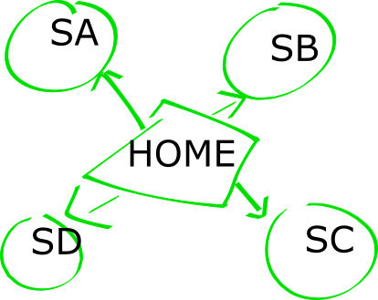

<!-- .slide: data-background="#4CA737" -->
## Technical Learning Session

---

## Technical Learning Session



- Blah blah `Source` is a stage with a single output.
- Defined as `Source[+Out, +Mat]`
    - `Mat` *defines the type* of the materialized value.

NOTE:
- Depending on the source, it may mean buffering or dropping, or it may simply mean slowing consumption.

---


## Sources from single elements

``` scala
val source: Source[String, NotUsed] = Source.single(
  "Hello World"
)
```

``` scala
val source: Source[String, NotUsed] = Source.repeat(
  "Hello World"
)
```

- single
	- *Push* a single element and then *complete*.
- something else
	- else