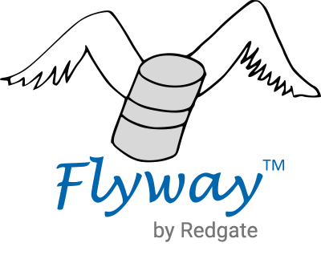

<!-- .slide: data-background="#4CA737" -->
## Flyway Schema Migration of CockroachDB Databases

---

## Learning Outcomes

<!-- .slide: style="text-align: left;"> -->  

In this presentation you will gain an understanding of:

- The basic definition of Flyway
- The use case driving Flyway use with CockroachDB
- Flyway architecture in relation to CockroachDC
- Flyway core components
- The general Flyway usage flow 

NOTE:

Prerequisites (for the video page in the LMS)
---

## Flyway

- Flyway is an open-source database migration tool.

NOTE:

- It strongly favors simplicity and convention over configuration.
- It is based around just 7 basic commands used in it's Command-line client:
	- We'll focus on `migrate` 
- The 7 basic commands: Migrate, Clean, Info, Validate, Undo, Baseline and Repair.

---

## Why Database Migrations? 

- MOCK DIAGRAM: show multiple databases (dev, integration/staging, test, prod)

NOTE:

- Most real-world applications have several databases from development to production.
- Overtime, table schemas evolve and change based on new business requirements.
	- For example, adding a new column to an existing table.
- Changing a table schema in a dev database will require changing the same table in stage, test, and prod.
- Flyway makes this straightforward.

---

## Flyway architecture in relation to CockroachDB

- MOCK DIAGRAM: show Flyway CLI, it's conf file, a sql version file and two CockroachDBs (dev, stage)

NOTE:

- Flyway CLI has a configuration file containing connection information to a CockroachDB
- Flyway CLI uses a sql versioning file to `migrate` a specific CockroachDB.
	- Flyway creates a migration table in the database that functions as an audit history of migrations.
- This Flyway `migration` process is repeated on all downstream databases needing the exact same change.	

---

## Flyway Core Components: flyway.conf

- MOCK DIAGRAM: show sample Flyway it's conf file

NOTE:

- The Flyway flyway.conf file contains the database connection information.

---

## Flyway Core Components: sql version migration

- MOCK DIAGRAM: show sample a sql version file

NOTE:

- This fly begins with four characters: V1__
	- These characters indicate the schema migration version.
	- They are stored in the Flyway schema migration table in the target database.	
---
## Flyway Usage Flow

- MOCK DIAGRAM: show two database: dev and stage, with a flyway CLI, number 1 against dev, two against stage

NOTE:

- Using the Flyway CLI you create the Connection to the first target database
- Apply the schema version migration SQL
- Using the Flyway CLI you create the Connection to the second target database
- Apply the same schema version migration SQL
- Inspect the changes in both databases

---

## Summary

<!-- .slide: style="text-align: left;"> -->  

In this chapter, you learned:

- The main use case driving Flyway use with CockroachDB
- The main components of Flyway's architecture
- The general Flyway usage flow